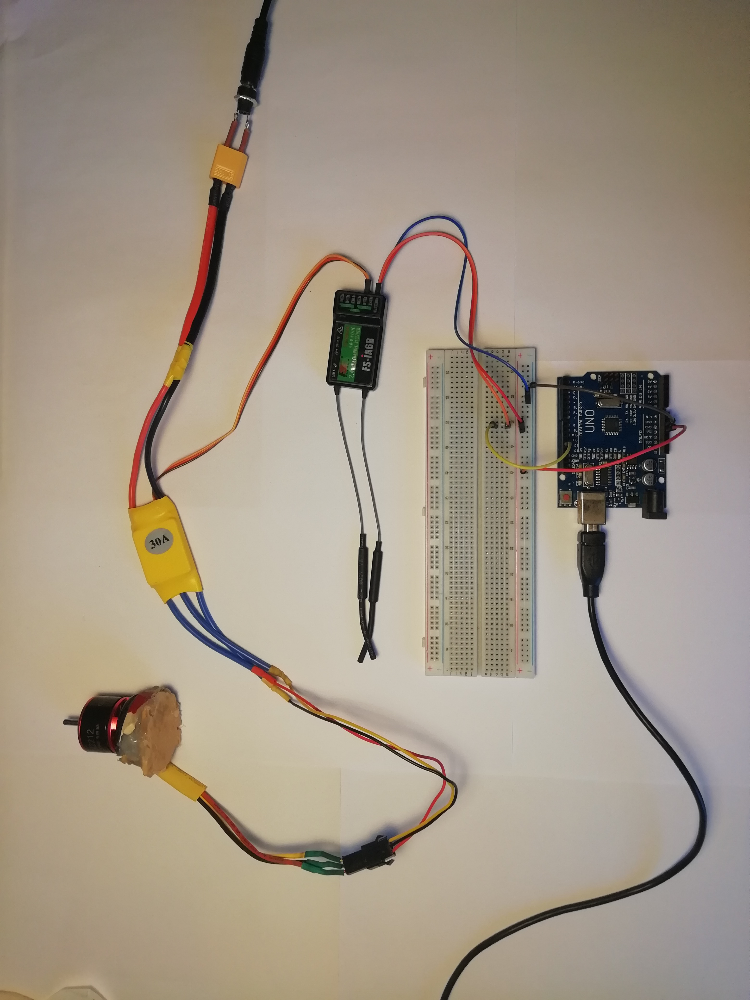

# RC-plane-autopilot
An Arduino project to make me a better RC-pilot

🛠️ Built by `Miro Mangelschots`
👀 Supervised by `Wouter Devriese`
@ `Ghent University` 🏛️ `Industrial Design Engineering`

11/04/2026

## Samenvatting
🚧 Under construction...

- doel
- elektrisch schema
- finaal product

## Introductie
🚧 Under construction...

## Inhoud

[A brief history](#a-brief-history)
[Verloop project](#verloop-project)
[...]()
[...]()
[...]()

### A brief history
Ongeveer de helft van mijn leven, is het al mijn droom om te vliegen... Niet ik als persoon, net als Icarus, maar met een zelfgemaakt model-vliegtuig. 

Het is een droom waarvoor ik al sinds mijn 9 jaar

Ik overloop hieronder de verschillende vliegtuigen die ik doorheen mijn leven al gemaakt heb.

>[!Tip]
>"CG" is de afkorting voor "Centre of Gravity" of zwaartepunt.
> Het zwaartepunt van een vliegtuig is zeer belangrijk: Te ver naar voor en het vliegtuig duikt naar beneden. Te ver naar achteren en het vliegt draait opwaards, waardaaor het vliegtuig "stalled" en achteruit naar beneden stort.

>[!Note]
>Alle besproken vliegafstanden zijn schattingen... De originale tests vonden te lang geleden plaats om correct te herineren. Aangezien de meeste vliegtuigen kapot zijn, kan er niet opniew getest worden.

#### 1. Cardboard glider

**Status**
🔴 Unable to fly
🔴 Broken

**Flaws**
⚠️ Too heavy
⚠️ Too small wing area
⚠️ Bad airfoil shape
⚠️ Wrong CG

 
 

#### 2. Foil V-wing 

**Status**
🔴 Unable to fly (~3m)
🔴 Broken

**Flaws**
⚠️ Too heavy???
⚠️ Wrong CG
⚠️ No airfoil
⚠️ Small wing area

**Improvements**
🫧 Bigger wing area
🫧 Lighter materials

 
 

#### 3. Foil rubber-band plane

**Status**
🔴 About as good as a parachute (~5m)
🔴 Broken

**Flaws**
⚠️ Heavy
⚠️ Wrong CG
⚠️ No airfoil
⚠️ 

**Improvements**
🫧 Active propulsion
🫧 Bigger wingspan

 
 

#### 4. RC wing (cardboard)

**Status**
🔴 Unable to fly
🔴 Dismantled

**Flaws**
⚠️ Wrong proppeler size for motor
⚠️ Way too heavy

**Improvements**
🫧 Based of an actual pattern of a working RC-plane 
🫧 Active propulsion
🫧 Radio controlled steering
🫧 Ultra stylish!!

 
 

#### 5. RC wing (foam)

**Status**
🔴 Unfinished

**Flaws**
⚠️ Still wrong propeller size
⚠️ Wrong plane-size for motor

 
 

#### 6. FT Edge 540

>Dit vliegtuig is gebaseerd op een Red Bull Air Race vliegtuig en werd gemaakt aan de hand van de instructie-video en patronen op de [Flight Test website](https://www.flitetest.com/articles/ft-edge-release).

**Status**
🟢 Does fly
🟠 Damaged from crash

**Flaws**
⚠️ I can't control it, I can't fly planes...

**Improvements**
🫧 Based of an actual pattern of a working RC-plane
🫧 Light foam build
🫧 Active propulsion
🫧 Radio controlled steering

 

>[!Important]
>Bij de FT Edge 540 heb ik beseft dat vanaf dat moment, het probleem niet meer het vliegtuig was, maar voornamelijk mijn vliegkunsten. Of eerder het tekort daaraan.
>Alhoewel ik een simulator had kunnen gebruiken om te trainen, is het vliegtuig gewoon aan mijn muur belandt.
>Op deze het idee belandt om een vliegassistent te meken voor mijn RC-vliegtuig.

 

### Verloop project
#### 1. PWM input
PWM signaal van Flysky receiver inlezen en plotten met ``pulseIn()``.
``PulseIn(pin, HIGH)`` leest hoeveel microseconden de pulse van het PMW-signaal ``HIGH`` is.

  

  

 

#### 2. PWM naar percent
Het ingelezen PWM-signaal staat uitgedrukt in µs, met een waarde tussen ``1000µs`` en ``2000µs``. Deze waarde wordt hier omgerekent naar percent.

``pulseIn`` meet hoe lang een pin ``HIGH`` blijft in microseconden. Hiermee kan het input signaal al gezien worden in de plotter. Daarna wordt het omgerekend naar een percentage.

Later bleek dat percentage niet nuttig was. In de finale code werdt het PWM-signaal omgerekend naar graden i.p.v. percent.
 

#### 3. I²C protocol
#TODO er bestaan librarys voor mpu6050... maar leuker zo en meer leerijk

 

#### 4. MPU6050
#TODO
verschillende data:
accel:
xyz
gyro:
xyz
T
 

#### 5. Graden °

 

#### 6. Servo

 

#### 7. Mixing

 

#### 8. Debugging
pulsin blocking... ==> using interrupt (meet begintijd, dan meet eindtijd => trek van elkaar af)

Readmpu 2x per loop => once

alpha verkeerd gemapt

 

#### 9. Smaller is better

werkt ook met nano, zonder extra aanpassingen:
Pins 2 and 3 → interrupt pins ✓
Pins 5, 6, 9 → PWM servo pins ✓
A4/A5 → I²C (SDA/SCL) ✓
 

## Noot inzake het gebruik van AI
🚧 Under construction...

## Bijlage
🚧 Under construction...

## Licentie
This repository contains software, design, and documentation created as part of a Arduino programming project at Ghent University.

Software and code: [MIT License](LICENSE-MIT) 
Design, documentation, CAD, and media: [CC BY 4.0 License](LICENSE)

>You are free to reuse and build upon this work, both commercially and non-commercially, as long as proper attribution is given to the original authors.

## Bronnen
🚧 Under construction...

